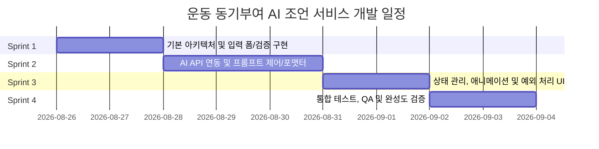

# 운동 동기부여 AI 조언 서비스 개발 계획서 (Sprint Roadmap)

> **문서 버전:** v1.0  
> **기준 문서:** `PRD.md` (운동 동기부여 AI 조언 서비스 - 1페이지 MVP)  
> **관리 경로:** `docs/development-plan.md`

---

## 1. 프로젝트 개요

### 1.1 목표
사용자가 키, 몸무게, 현재 마음가짐을 입력하고 원하는 조언 톤(쓴소리, 현실직시, 따뜻한 공감)을 선택하면, AI가 분석하여 이모티콘이 포함된 **정확히 3줄 분량의 맞춤형 조언**을 제공하여 운동 실행을 유도하는 1페이지 웹 애플리케이션 개발.

### 1.2 핵심 성공 지표 (KPI)
* **기능 완수율:** 입력 폼 검증, 로딩 애니메이션, AI 응답 연동, 3줄 출력, 예외 처리 100% 충족.
* **응답 시간:** AI 요청 후 5~10초 사이에 결과 화면 렌더링 (95% 이상).
* **재이용률:** '다시 하기' 및 '원하는 느낌 나올 때까지 다시 생성'의 원활한 UX 제공.

---

## 2. 전체 스프린트 요약 (Overview)

| 스프린트 | 주요 목표 | 핵심 산출물 | 예상 기간 |
| :--- | :--- | :--- | :--- |
| **Sprint 1** | 아키텍처 구조화, 입력 폼 컴포넌트화 & 엄격한 검증/Sanitization | `types/`, `components/form/`, 검증 로직 | Day 1 ~ Day 2 |
| **Sprint 2** | AI 조언 생성 API 라우트 구축, 프롬프트 엔지니어링 & 3줄 포맷터 | `/api/advice`, `lib/ai/`, 프롬프트 템플릿 | Day 3 ~ Day 5 |
| **Sprint 3** | 로딩 애니메이션 연동, 상태 머신 & 5대 예외 처리 UI 완성 | `components/loading/`, `components/result/`, 에러 핸들러 | Day 6 ~ Day 7 |
| **Sprint 4** | PRD 완료 조건 전수 검증, 모바일/반응형 최적화, 배포 준비 | QA 체크리스트, E2E 검증, `walkthrough.md` | Day 8 ~ Day 9 |

---

## 3. 스프린트별 상세 개발 계획

---

### 🏃 Sprint 1: 아키텍처 구조화 & 입력 폼 및 검증 시스템

#### 1) 목표
* 단일 파일에 집중되어 있던 코드를 역할별 모듈(컴포넌트, 훅, 유틸리티, 타입)로 분리하고, PRD에 명시된 엄격한 폼 검증과 입력 데이터 Sanitization을 구현한다.

#### 2) 세부 작업 항목 (Tasks)
- [ ] **Type & Model 정의 (`types/advice.ts`)**
  - 신체 정보(키, 몸무게), 마음가짐, 조언 톤(`spicy` | `realistic` | `warm`) 타입 정의
  - 요청/응답 페이로드 및 폼 에러 상태 타입 정의
- [ ] **입력 데이터 Sanitization 유틸 (`lib/sanitize.ts`)**
  - XSS 방지를 위한 HTML/스크립트 태그 이스케이프 및 공백 정규화 (PRD 예외규칙 #4)
- [ ] **유효성 검증 시스템 구축 (`lib/validation.ts`)**
  - 필수값 누락 검사 (키, 몸무게, 마음가짐, 톤)
  - 미입력 필드별 구체적인 한글 에러 메시지 생성 (예: `"키 칸이 비어있어요"`, `"몸무게 칸이 비어있어요"`, `"현재 마음가짐 칸이 비어있어요"`) (PRD 예외규칙 #1)
  - 숫자 범위(키, 몸무게 양수 여부) 검증
- [ ] **입력 폼 컴포넌트 분리 (`components/form/AdviceForm.tsx`, `Field.tsx`, `ToneSelector.tsx`)**
  - 키(cm), 몸무게(kg), 현재 마음가짐(textarea), 조언 톤 선택 라디오 그룹
  - 미입력 시 필드 하단 빨간색 경고 문구 실시간 및 제출 시 반영
  - Primary CTA 버튼 (`조언 받기`)

#### 3) 완료 조건 (Definition of Done)
- [x] 빈 필드가 있을 때 제출 시 AI 요청으로 넘어가지 않고 해당 필드 아래 빨간 에러 메시지가 표시되는가?
- [x] 특수문자나 스크립트 태그 입력 시 안전하게 이스케이프 처리되는가?
- [x] 컴포넌트 구조가 모듈화되어 유지보수가 용이한가?

---

### 🤖 Sprint 2: AI 조언 생성 API & 프롬프트/포맷팅 파이프라인

#### 1) 목표
* Next.js App Router 기반의 서버 API(`/api/advice`)를 구축하고, LLM을 연동하여 톤별 페르소나 프롬프트를 적용하고, 어떤 경우에도 **정확히 3줄 & 이모티콘 포함** 응답을 보장하는 파이프라인을 구축한다.

#### 2) 세부 작업 항목 (Tasks)
- [ ] **AI Provider 설정 (`lib/ai/client.ts`, `.env.local`)**
  - AI API Client (Google Gemini / OpenAI / Serverless API) 설정
  - API Key 환경 변수 분리 및 보안 처리
- [ ] **톤별 프롬프트 엔지니어링 (`lib/ai/prompts.ts`)**
  - **쓴소리 (Spicy):** 나태함을 깨우는 팩트 폭격 + 강렬한 이모티콘 (🔥, ⚡, 😤)
  - **현실직시 (Realistic):** 객관적 신체/상태 분석 + 실천 가능한 조언 (🏋️‍♂️, ⏱️, 📊)
  - **따뜻한 공감 (Warm):** 지친 마음 다독이기 + 포근한 격려 (🫂, 🌿, ✨)
  - **공통 제약:** 이모티콘/표정 특수문자 필수 포함, 정확히 3문장/3줄(`\n`) 출력
- [ ] **3줄 보장 포맷터 & Validator (`lib/ai/formatter.ts`)**
  - AI 응답이 1~2줄이거나 4줄 이상일 경우 줄바꿈 기준 스마트 분할/통합 처리 (PRD 예외규칙 #3)
  - 이모티콘 누락 시 기본 톤별 이모티콘 자동 보정
- [ ] **Route Handler 구현 (`app/api/advice/route.ts`)**
  - POST 요청 파싱, Sanitization 및 검증 수행
  - AI 요청 실패/타임아웃 핸들링 및 표준화된 에러 응답 반환
  - 5~10초 응답 시간 조율 (AI 처리 시간 + UX 애니메이션 타이밍 동기화)

#### 3) 완료 조건 (Definition of Done)
- [x] API 요청 시 사용자가 선택한 톤과 입력 정보가 올바르게 프롬프트에 반영되는가?
- [x] 생성된 결과가 항상 이모티콘이 포함된 정확히 3줄로 반환되는가?
- [x] API 키 미설정 또는 네트워크 오류 시 정형화된 JSON 에러를 반환하는가?

---

### 🎨 Sprint 3: 상태 관리, 애니메이션 및 5대 예외 처리 완성

#### 1) 목표
* 전체 뷰 상태머신(`form` | `loading` | `result` | `error`)을 정교화하고, 운동하는 캐릭터 로딩 애니메이션, 버튼 디바운싱, 재시도/초기화 플로우를 완성한다.

#### 2) 세부 작업 항목 (Tasks)
- [ ] **상태 관리 훅 (`hooks/useAdviceFlow.ts`)**
  - 상태 머신 관리 (`form` -> `loading` -> `result` / `error`)
  - 중복 제출 방지 (Debouncing & `isSubmitting` flag 활성화) (PRD 예외규칙 #5)
  - 입력값 유지 및 초기화(`reset`) 기능
- [ ] **로딩 애니메이션 컴포넌트 (`components/loading/LoadingCard.tsx`)**
  - 운동하는 캐릭터 CSS 키프레임 애니메이션 (팔굽혀펴기/스쿼트/달리기 모션)
  - 롤링 로딩 문구 인터벌 노출 (`마음의 준비운동을 하는 중...`, `당신에게 딱 맞는 말을 고르는 중...` 등)
  - 로딩 중 '돌아가기' 네비게이션 제공
  - 5~10초 시간대 UX 보장
- [ ] **결과 화면 컴포넌트 (`components/result/ResultCard.tsx`)**
  - 선택한 톤에 맞춘 테마 컬러 및 이모티콘 3줄 조언 카드
  - `다시 하기` 버튼 (폼 초기화 후 첫 화면 스크롤 포커스)
  - `원하는 느낌 나올 때까지 다시 생성` 버튼 (동일 조건 AI 재요청)
- [ ] **에러 상태 및 Fallback UI (`components/error/ErrorCard.tsx`)**
  - API 에러 발생 시 `"조언을 불러오지 못했어요 😢"` 및 `다시 시도하기` 버튼 제공 (PRD 예외규칙 #2)
  - 새로고침 시 초기 화면으로 안전하게 리셋되는 동작 보장

#### 3) 완료 조건 (Definition of Done)
- [x] `조언 받기` 클릭 즉시 버튼이 비활성화되고 로딩 애니메이션이 동작하는가?
- [x] 로딩 중 중복 클릭이 방지되는가?
- [x] '다시 하기'와 '다시 생성'이 PRD 명세대로 정상 동작하는가?
- [x] 에러 발생 시 앱이 크래시되지 않고 에러 카드 및 재시도 버튼이 노출되는가?

---

### 🧪 Sprint 4: 통합 테스트, 품질 보증(QA) & 릴리즈

#### 1) 목표
* PRD 완료 조건(Checklist)의 6개 항목을 전수 검증하고, 브라우저 접근성(ARIA), 모바일 반응형 디자인 점검 후 배포 준비를 완료한다.

#### 2) 세부 작업 항목 (Tasks)
- [ ] **PRD 완료 조건 검증 (Checklist Validation)**
  - [ ] 키, 몸무게, 현재 마음가짐 입력 후 버튼 클릭 시 5~10초 사이에 결과가 표시되는가?
  - [ ] 입력 항목이 비어있을 경우 빨간 글씨로 `"00칸이 비어있어요"` 문구가 뜨고 다음 단계로 넘어가지 않는가?
  - [ ] 처리 중(5~10초) 동안 조금씩 움직이며 운동하는 캐릭터 애니메이션이 렌더링되는가?
  - [ ] 결과 조언에 이모티콘/표정 특수문자가 포함되어 있으며, 정확히 3줄로 출력되는가?
  - [ ] AI 응답이 실패하더라도 화면이 멈추지 않고, '다시 하기' 또는 재시도 버튼이 정상 동작하는가?
  - [ ] 새로고침 시 초기 입력 페이지로 정상 되돌아가는가?
- [ ] **UI/UX & 디바이스 최적화**
  - 모바일, 태블릿, 데스크톱 반응형 뷰포트 정밀 튜닝
  - 스크린 리더 지원(Aria-live, Role, Label) 및 포커스 트랩 방지
- [ ] **문서화 및 유지보수 가이드 업데이트**
  - `README.md` 및 `docs/` 내 API/컴포넌트 명세 정리

---

## 4. 위험 요소 및 대응 방안 (Risk Management)

| 리스크 항목 | 영향도 | 발생 가능성 | 대응 방안 |
| :--- | :---: | :---: | :--- |
| **AI 응답 지연/타임아웃 (10초 초과)** | 높음 | 중간 | API 타임아웃(8초) 설정 후 Fallback 조언 데이터베이스에서 톤별 프리셋 제공 |
| **AI 포맷 불일치 (줄바꿈 오류)** | 보통 | 높음 | 클라이언트/서버 2중 포맷팅 파서로 3줄 정규화 강제 |
| **API Key 노출 위험** | 높음 | 낮음 | 서버 사이드 Route Handler(`/api/advice`)에서만 API 호출 및 환경 변수 암호화 |
| **입력값 악의적 스크립트 삽입** | 높음 | 낮음 | Sanitization 파이프라인 적용 및 React 기본 이스케이프 활용 |

---

## 5. 향후 확장 고려사항 (Backlog)
* 조언 카드 이미지 캡처 및 인스타그램 스토리 공유 기능
* 사용자 선호 톤 및 최근 조언 로컬스토리지 히스토리 저장 (선택적)
* 운동 완료 체크 버튼 및 연속 출석 스트릭(Streak) 기능
